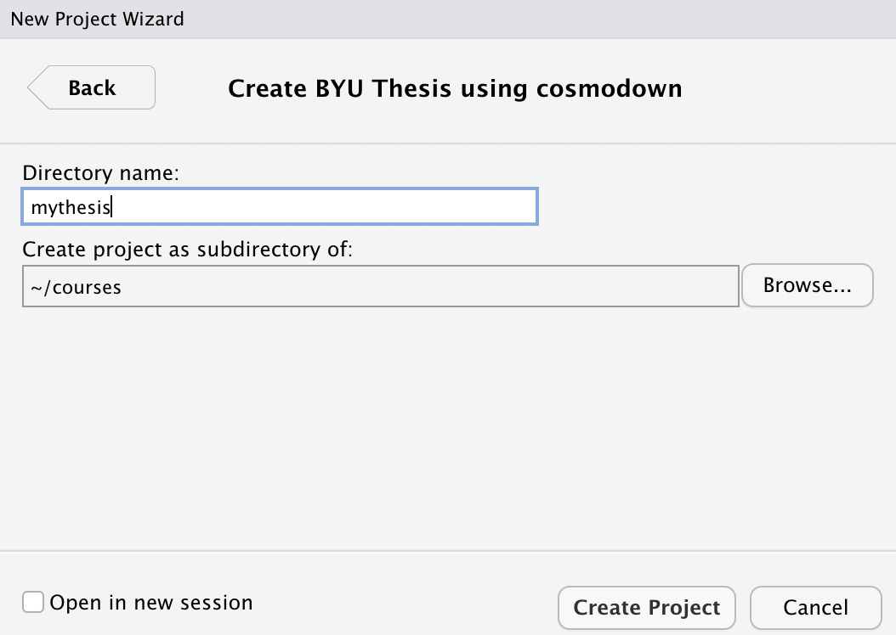
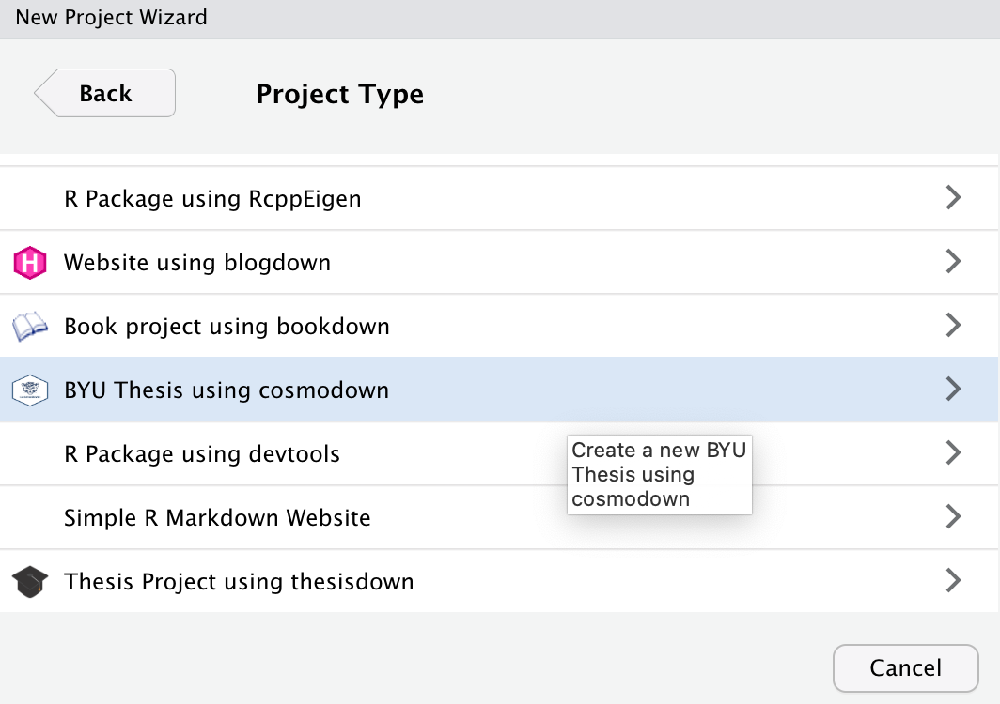
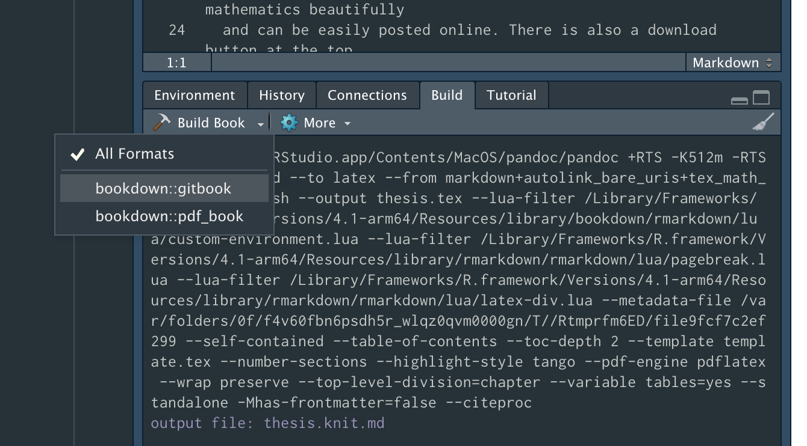

<!-- README.md is generated from README.Rmd. Please edit that file -->

```{r, echo = FALSE}
knitr::opts_chunk$set(
  collapse = TRUE,
  comment = "#>",
  fig.path = "README/README-fig-",
  out.width = "50%",
  fig.align = "center"
)
```

# cosmodown 

<!-- badges: start -->
<!-- badges: end -->

This package provides a template for writing theses and dissertations at 
Brigham Young University using **rmarkdown** and **bookdown**. Much of this was
inspired by the [**thesisdown**](https://github.com/ismayc/thesisdown) package
by Chester Ismay, and this particular implementation was taken directly from [**jahawkdown**](https://github.com/wjakethompson/jayhawkdown) by Jake Thompson.

The original LaTeX template and class document were written by Greg Macfarlane,
and modified for use with pandoc and R markdown. If you are looking for the 
BYU LaTeX class only, [it is available here.](https://github.com/byu-transpolab/byuthesis)

## Installation

You can install cosmodown from github with:

```{r gh-installation, eval = FALSE}
# install.packages("devtools")
devtools::install_github("gregmacfarlane/cosmodown")
```

You also need a working LaTeX program; I recommend the 
[TinyTeX distribution](https://yihui.org/tinytex/), but 
complete LaTeX distributions are available below:

* Macintosh: [MacTeX](https://tug.org/mactex/mactex-download.html)
* Linux: [TeXLive](https://www.tug.org/texlive/acquire-netinstall.html)
* Windows: [TeXLive](https://www.tug.org/texlive/windows.html)


## Example Usage

The recommended way to use this template is with RStudio; however, it is
possible to use this template with a different IDE.

### RStudio Usage

1. Open Rstudio
2. Start a new Rstudio project in a new directory

    ```{r select-rmd, echo = FALSE}
    
    ```

3. On the list of templates, select "BYU Thesis using **cosmodown**".

    ```{r select-template, echo = FALSE}
    
    ```

4. On the new project page, name your project and give it a location. This will
be the name of the folder as well as the `.Rproj` Rstudio project file.

    ```{r new-project, echo = FALSE}
    
    ```
    
5. Select "OK", and the new project should open automatically. Press the "Knit" button at the top of the editor to render the template (to a website), 

    ```{r knit-tempalte, echo = FALSE}
    
    ```

6. If the PDF does not open automatically, you will be able to find it in the newly created `_book/` directory.

### Troubleshooting

If the example PDF fails to render, try these steps:

* If you are not using RStudio, attempt to render in RStudio.
* Make sure your LaTeX environment was successfully setup.
* Make sure your R packages are up to date, specifically **rmarkdown**, **bookdown**, **cosmodown**, and **knitr**.

If errors persist after trying all of these steps, post your process along with the resulting error to a [new issue](https://github.com/gregmacfarlane/cosmodown/issues) on Github, and I will try to help.
