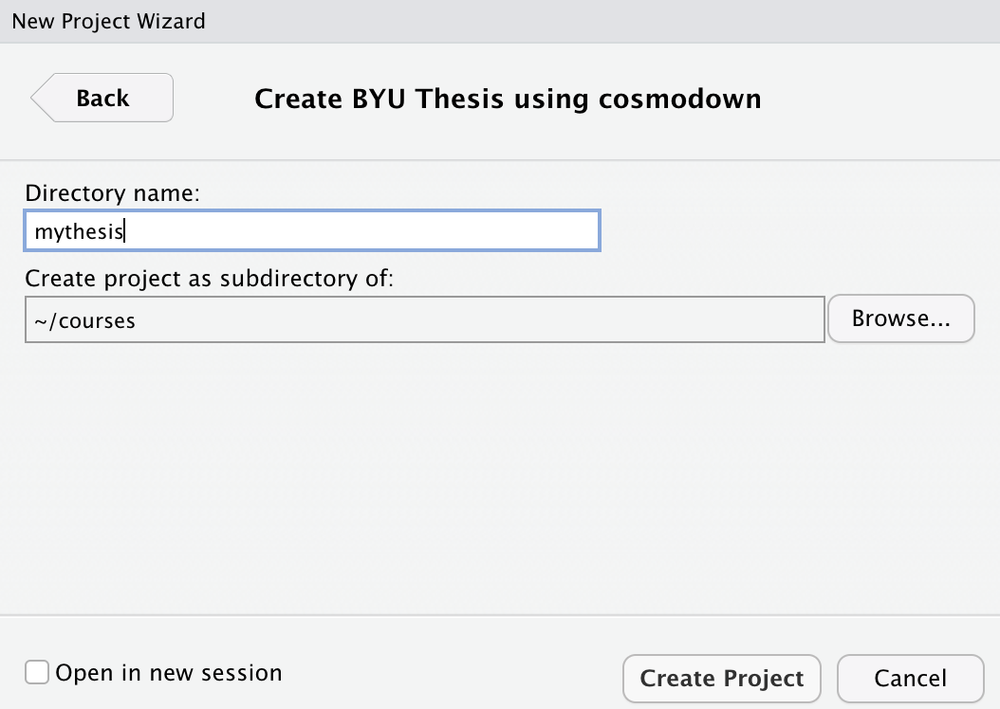
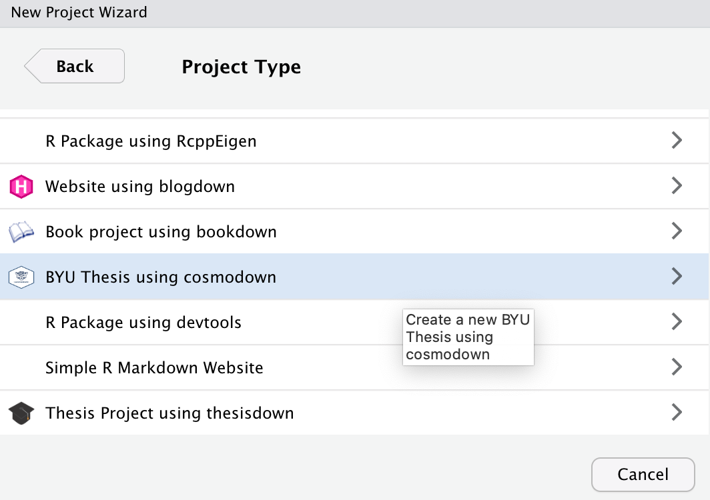
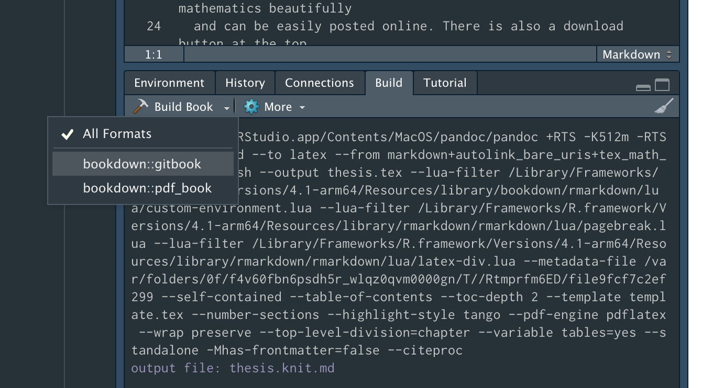

<!-- README.md is generated from README.Rmd. Please edit that file -->

# cosmodown 

<!-- badges: start -->
<!-- badges: end -->

This package provides a template for writing theses and dissertations at
Brigham Young University using **rmarkdown** and **bookdown**. Much of
this was inspired by the
[**thesisdown**](https://github.com/ismayc/thesisdown) package by
Chester Ismay, and this particular implementation was taken directly
from [**jahawkdown**](https://github.com/wjakethompson/jayhawkdown) by
Jake Thompson.

The original LaTeX template and class document were written by Greg
Macfarlane, and modified for use with pandoc and R markdown. If you are
looking for the BYU LaTeX class only, [it is available
here.](https://github.com/byu-transpolab/byuthesis)

## Installation

You can install cosmodown from github with:

``` r
# install.packages("devtools")
devtools::install_github("gregmacfarlane/cosmodown")
```

You also need a working LaTeX program; I recommend the [TinyTeX
distribution](https://yihui.org/tinytex/), but complete LaTeX
distributions are available below:

-   Macintosh: [MacTeX](https://tug.org/mactex/mactex-download.html)
-   Linux:
    [TeXLive](https://www.tug.org/texlive/acquire-netinstall.html)
-   Windows: [TeXLive](https://www.tug.org/texlive/windows.html)

## Example Usage

The recommended way to use this template is with RStudio; however, it is
possible to use this template with a different IDE.

### RStudio Usage

1.  Open Rstudio

2.  Start a new Rstudio project in a new directory

    

3.  On the list of templates, select “BYU Thesis using **cosmodown**”.

    

4.  On the new project page, name your project and give it a location.
    This will be the name of the folder as well as the `.Rproj` Rstudio
    project file.

    

5.  Select “OK”, and the new project should open automatically. To
    render the document to a website and to a PDF, push the “Build Book”
    button under the “Build” tab. This button also has a drop-down that
    will allow you to build either the site or the PDF.

    

6.  The site and the rendered PDF will be stored in the `docs/` folder.

### Troubleshooting

If the example PDF fails to render, try these steps:

-   If you are not using RStudio, attempt to render in RStudio.
-   Make sure your LaTeX environment was successfully setup.
-   Make sure your R packages are up to date, specifically
    **rmarkdown**, **bookdown**, **cosmodown**, and **knitr**.

If errors persist after trying all of these steps, post your process
along with the resulting error to a [new
issue](https://github.com/gregmacfarlane/cosmodown/issues) on Github,
and I will try to help.
